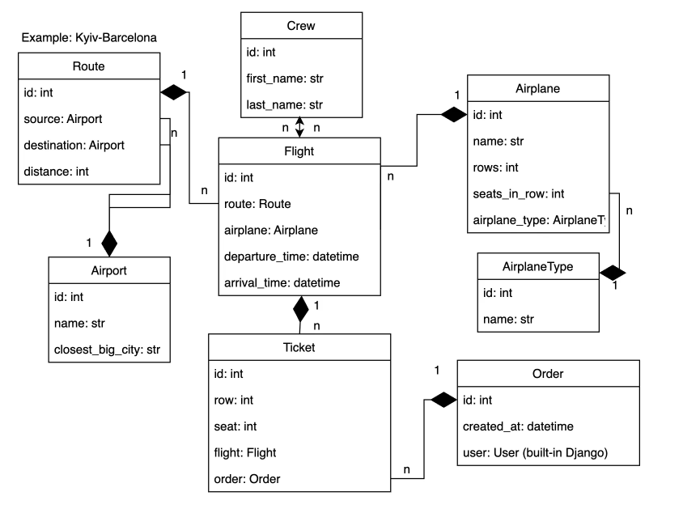
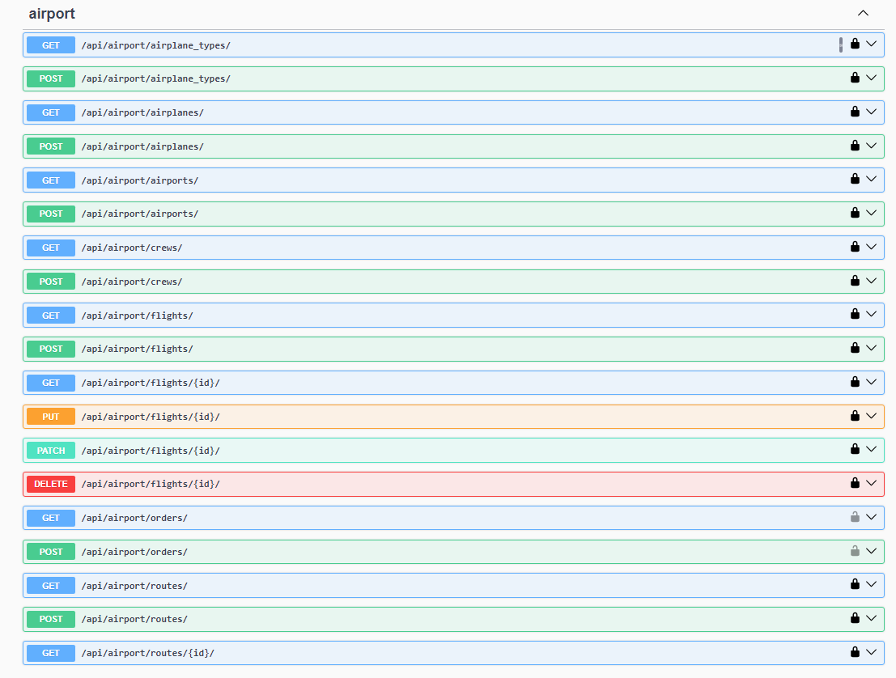
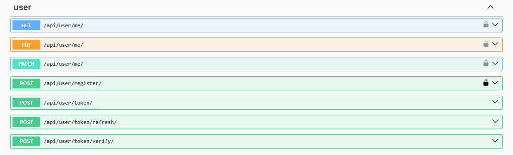
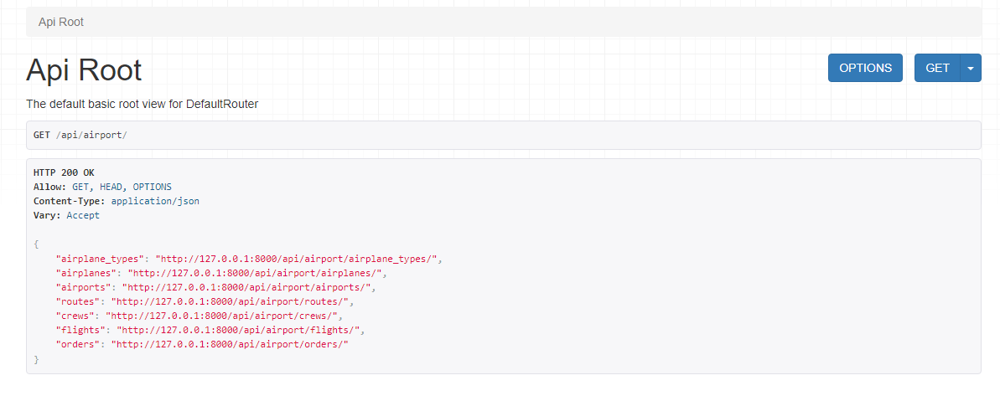
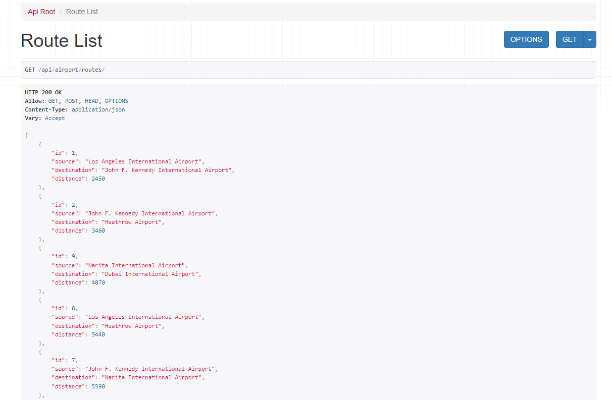
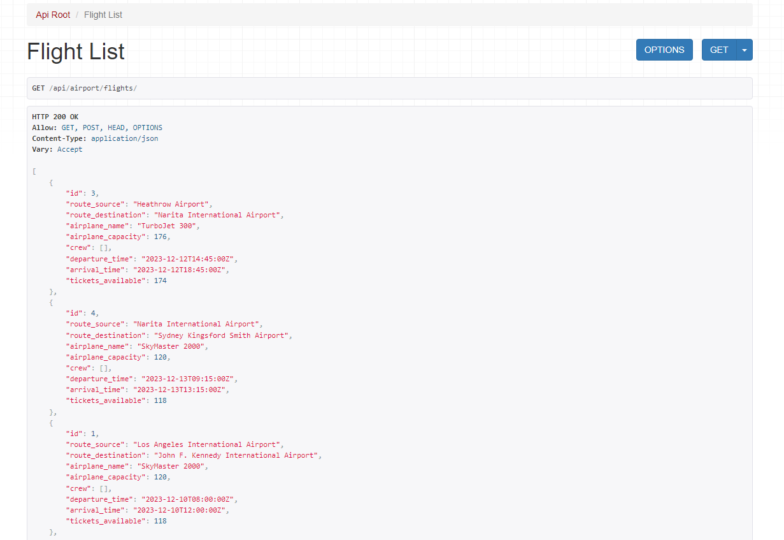
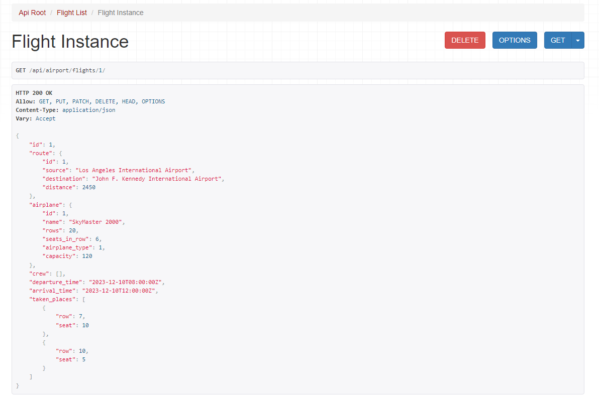

# Airport API Service
API Service for Airport Management written on DRF

## Features
* JWT Authentication
* Admin panel
* Swagger API documentation
* Throttling
* Managing flights
* Managing orders and tickets
* Filtering airports by city
* Filtering routes by source, destination
* Filtering flights by routes, date

## Installation
1. Clone the repository
```
https://github.com/artur-leleiko/airport-api-service.git
```

2. Navigate to the project directory
```
cd airport-api-service
```

3. Create an .env file and define the environment variables using .env.sample
4. Build Docker container
```
docker-compose build
```

5. Start the Docker container
```
docker-compose up
```

## DB Structure


## Screenshots





